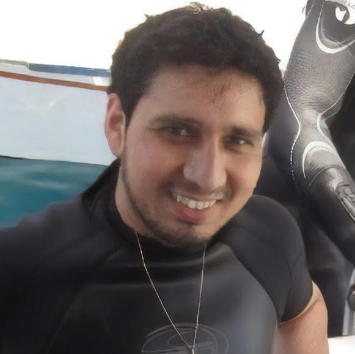

I am a Galápagueño dedicated to preserving island ecosystems. Currently I am a PhD student in the lab of [Dr. Corrie Moreau](http://www.moreaulab.entomology.cornell.edu/) in the Department of Entomology at Cornell University. I study invasive earthworms in the Galapagos Islands, which together with invasive ants may be contributing to the spread of invasive plant populations. My goal is to understand the introduction history of invasive earthworms and their evolutive response to the hostile environment of the Galapagos and to the co-occurrence of other invasive species, using mainly phylogenetic tools.